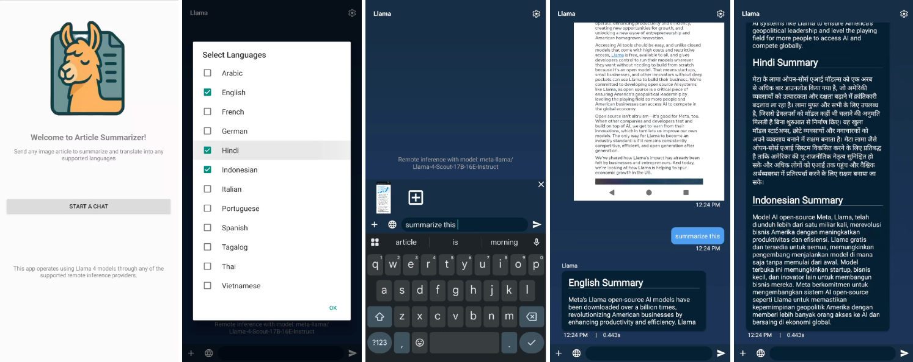

# Android Article Summarizer App

This is a sample Android app to demonstrate Llama 4 multimodal and multilingual capabilities. This app allows user to take a picture/screenshot of an article, and then summarize and translate it into any of the supported languages

## Quick Start

1. Open the ArticleSummarizer folder in Android Studio
2. Update the `API_KEY` in `AppUtils.java`
3. Build the Android Project
4. Inside the app, tap on settings icon on top right
5. Configure the Remote URL endpoint (any supported providers that serve Llama 4 models. For example: https://api.together.xyz)
6. Select the desired model from the drop down list. If you need to add more models, modify `ModelUtils.java`
7. Go back to the Main chat window
8. Press the '+' button on the bottom left and select an image article (or take a picture of one!)
9. Select the 'globe' button on the bottom left and select your languages
10. Enter a prompt like "summarize this" and press Enter!

> **_NOTE:_**  This is an example project to demonstrate E2E flow. You should NOT use/store API key directly on client. Exposing your API key in client-side environments allows malicious users to take that key and make requests on your behalf. Requests should always be routed through your own backend server where you can keep your API key secure.

## Reporting Issues
If you encountered any bugs or issues following this tutorial please file a bug/issue here on [Github](https://github.com/meta-llama/llama-cookbook/issues)).
