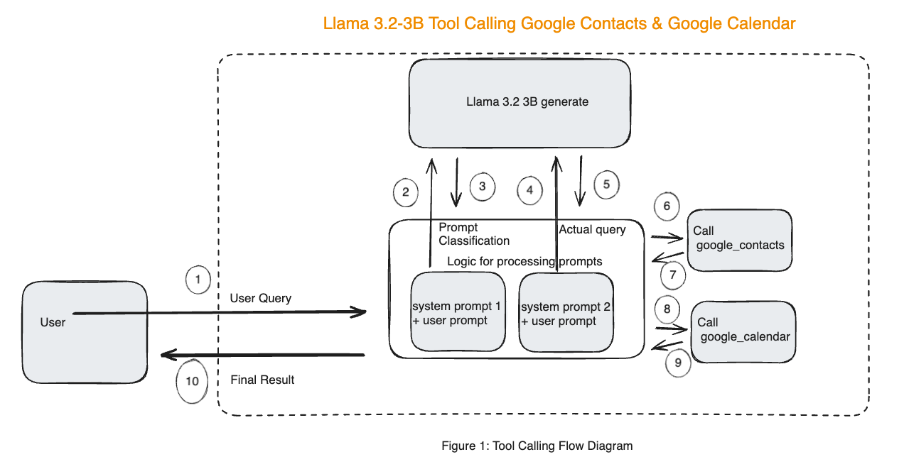

# Google Calendar Assistant with with Llama 3.2 3B Tool Calling

This notebook showcases how to go about building a digital assistant to schedule meetings with the Llama 3.2 3B model. The core concepts used to implement this are Prompt Engineering and Tool Calling. This demo shows how Llama can be used to interact with 3rd party apps like Google Contacts & Google Calendar and schedule a meeting requested by the user. Even though we are using prompt engineering to achieve this, the approach described doesn't degrade the model's ability to answer general queries. This approach can extended to perform other tasks in a similar manner without affecting the quality of other tasks


## Approach

Instead of using a complex system prompt with multiple conditions & expecting Llama to perform various tasks accurately out of the box, the approach here is to treat this as a 2 step process
- Determine user intent - Task classification
- Take action for the specific task using Tool Calling


In the diagram shown below,
- system prompt 1 determines the classification of the query
- In steps 2 & 3, we classify the task being requested.
- system prompt 2 is chosen based on the classification result
- Steps 4 & 5 implement the classified task.
- For the sake of demo, we show 2 classes: General & Meeting



Both these tasks have a specific prompt. We use the same model with different system prompts depending on the classification result.
Additionally, this demo also showcases how Llama can be used to do double tool calling with 1 prompt. In the case of Meeting, Llama returns 2 function calls in Step 5
```
<function=google_contact>{{"name": "John Constantine"}}</function>
<function=google_calendar>{{"date": "Mar 31 ", "time": "5:30 pm", "attendees": "John Constantine"}}</function>
```

## Examples

- General query

  **User Prompt** : `Tell me about Paris`

  **Prompt Classification**: `general`

  **Answer**: 
```
Paris, the City of Light, is the capital of France. Known for its stunning architecture, art museums, and romantic atmosphere, Paris is a popular tourist destination. The city is famous for its iconic landmarks such as the Eiffel Tower, Notre-Dame Cathedral, and the Louvre Museum, which houses the Mona Lisa. Paris is also renowned for its fashion, cuisine, and wine. The city's charming streets and historic neighborhoods, like Montmartre and Le Marais, offer a glimpse
```

- Set up a Calendar Invite

  **User Prompt** : `Schedule a meeting with John Constantine on Mar 31 at 5:30 pm`

  **Prompt Classification**: `meeting`

  **Answer**: 
```
  <function=google_contact>{{"name": "John Constantine"}}</function>
  <function=google_calendar>{{"date": "Mar 31", "time": "5:30 pm", "attendees": "John Constantine"}}</function>
```

### Actions based on tool calling output
- The google_contact function call returned by the model is used to call [People API](https://developers.google.com/people) to look up the email address of the person of interest
- The email address from the previous step is used to call [Calendar API](https://developers.google.com/calendar) along with the other information in the google_calendar tool calling output returned by the model 

The end result is that a google meeting is scheduled with the person of interest at the date & time specified

