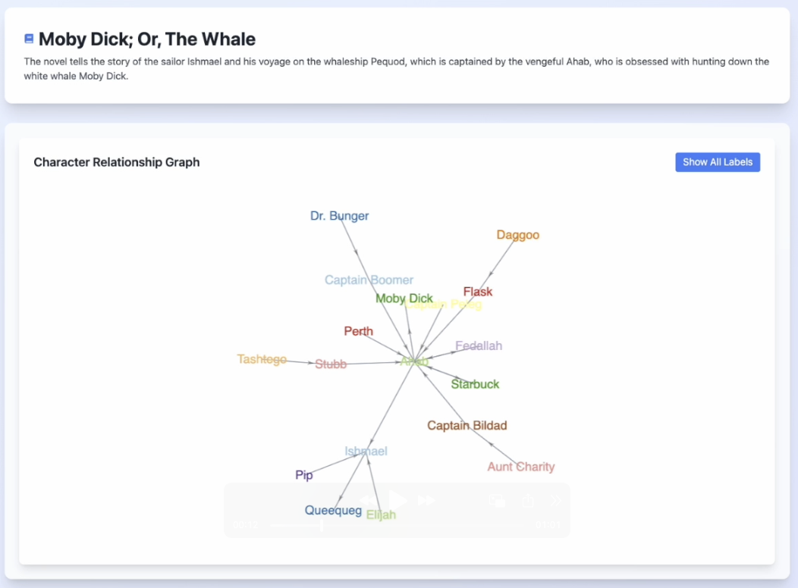
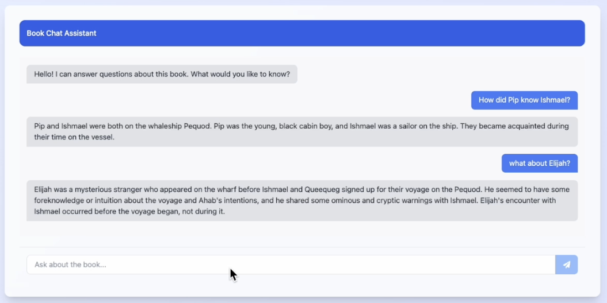

# Book Character Mind Map With Llama4 Maverick



Book Mind is a web application that allows users to explore character relationships and storylines in books using AI-powered visualizations.
This leverages **Llama 4 Maverick**'s impressive 1M token context windows to process entire books at once, enabling comprehensive analysis of complex narratives and character relationships across lengthy texts.

## Features

### Leverage Long Context Length
| Model | Meta Llama4 Maverick | Meta Llama4 Scout | OpenAI GPT-4.5 | Claude Sonnet 3.7 |
| ----- | -------------- | -------------- | -------------- | -------------- |
| Context Window | 1M tokens | 10M tokens | 128K tokens | 1K tokens | 200K tokens |

Because of the long context length, Book Mind can process entire books at once, providing a comprehensive understanding of complex narratives and character relationships.

- Interactive Mind Maps: Visualize relationships between characters and plot elements.
- Book Summaries: Get concise overviews of plots and themes.

### Step-by-Step Instructions

We implemented a step-by-step approach to ensure the model outputs' reliability.

1. **Character Identification**: Identify all characters in the book and summarize their roles.
```
You are a highly detailed literary analyst AI. Your sole mission is to meticulously extract comprehensive information about characters and the *nuances* of their relationships from the provided text segment. This data will be used later to build a relationship graph.
```

2. **Character Relationships**: Determine the relationships between characters.
```
You are an expert data architect AI specializing in transforming literary analysis into structured graph data. Your task is to synthesize character and relationship information into a specific JSON format containing nodes and links, including a title and summary.
```

3. **JSON Format**: Output the results in a JSON format for easy parsing and visualization.
```
You are an extremely precise and strict JSON extractor.
Extract only the complete JSON object from the input. Get the last one if there are multiple.
```

### Ask the Book with Chat Interface

We also implemented a chat interface to interact with the book. Users can ask questions about the book's characters, plot, and relationships. The model will respond with a concise answer based on the book's content and the relationships between characters.

```
You are an expert search AI designed to help users find detailed information about character relationships from a book. Your task is to assist users in querying the relationship data extracted from the book.
```



## Getting Started

### Frontend Setup
To communicate with the [server/server.py](server/server.py), we use `React.js` and `axios`.

1. Install dependencies:

```
npm install
```

2. Run the application:

```
npm start
```

### Server Setup

We use `Flask` to serve the model's responses and `vllm` to run the **Llama 4 Maverick** model.

1. Install dependencies:
```
cd server
pip install -r requirements.txt
```

2. Run the server:
```
python server.py
```

## Get Copyright Free Books

- [Project Gutenberg](https://www.gutenberg.org/)
  - [Romeo and Juliet](https://www.gutenberg.org/ebooks/1513): 50,687 input tokens
  - [Moby-Dick; The Whale](https://www.gutenberg.org/ebooks/2701): 318,027 input tokens
